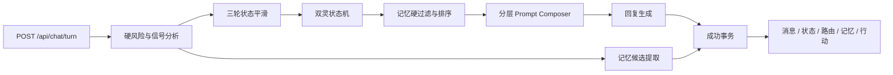

# 角色与记忆模块工程集成说明

## 主链路



高风险在 B 后直接进入静态安全响应，不装配角色、Lore、关系记忆或行动上下文，也不运行记忆提取。

## 代码位置

- `packages/shared/src/index.ts`：`ActiveSpirit`、`TransitionStyle`、角色诊断和记忆契约。
- `server/src/modules/character`：版本化 Core Soul、深汐、拾岸、Lore、启动校验和 Prompt Composer。
- `server/src/modules/support/policy-router.ts`：自然语言边界和带滞后的自动双灵状态机。
- `server/src/modules/support/orchestrator.ts`：统一平滑、路由、召回上下文、生成和候选提取。
- `server/src/modules/memory`：Schema、确定性 Guard、无向量排序、预算和 Repository。
- `server/prisma/schema.prisma`：灵格状态与 `MemoryItem/MemoryEvidence/MemoryRevision`。
- `server/src/routes/chat.ts`：完整模式事务持久化。
- `server/src/demo/store.ts` 与 `server/src/routes/demo.ts`：同契约的进程内实现。
- `web/src/App.tsx`：无模式控件的连续角色体验；demo/lab 显示诊断。

## API 变更

`POST /api/chat/turn` 只接收 `conversationId` 和 `text`；多余的旧 `intent` 字段会被拒绝。响应不再包含 `mode` 或 `modeTransition`。demo/lab 的普通响应可包含 `characterDiagnostics`；full 不暴露内部灵格名称。高风险响应不包含角色诊断、情绪诊断或情绪飘字。

## 数据迁移

迁移 `202608140003_character_memory` 会：

1. 将旧 `Conversation.mode` 和 `SupportEvent.surfaceMode` 映射为 `activeSpirit`；
2. 删除旧 `mode_transitions` 数据表和 `Turn.intent`；
3. 增加灵格计数、锁定、路由原因、过渡和角色版本；
4. 创建三张记忆表、索引、级联外键和 active 结构键唯一约束。

应用迁移前必须备份数据库并记录迁移版本。回滚采用恢复迁移前备份，不尝试重建已按要求删除的旧模式邀请数据。

## 验证命令

```text
npm run db:generate
npm run typecheck
npm test
npm run build
npm run test:e2e:demo
```

完整数据库验证需设置独立 `TEST_DATABASE_URL`、应用全部迁移后执行 `npm run test:integration`。真实模型对照使用本地密钥执行 `npm run test:model`；报告不保存完整用户原文。

## 后续里程碑

当前包体不包含用户记忆设置中心。外部研究扩大前需要实现记忆策略、列表、修改、逐条删除、全部遗忘、关闭写入/召回和对应权限/无障碍测试。
