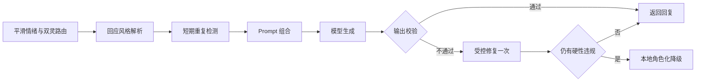

# 澜泊回应风格调试指南

## 目的

回应风格层位于双灵路由之后、Prompt 组合之前。它不改变风险判断、灵格或行动授权，只把本轮情绪状态转换成可检查的语言参数，让“更慢、更短、更温暖”成为确定规则，而不是散落在 Prompt 里的形容词。

## 四个调节位置

1. **角色卡**：修改澜泊长期不变的身份、信念、边界和深汐/拾岸差异。修改后必须提升角色版本并运行角色冻结集。
2. **风格解析器**：修改情绪阈值以及语速、句长、温度、提问、建议、隐喻和幽默的映射。修改后运行 40 条风格矩阵。
3. **语言注册表**：修改允许的句式家族、标志性表达、隐喻标记和禁用套话。不要把用户输入中的同名短语当作系统指令。
4. **冻结样本**：增加真实但去标识化的场景，防止一次措辞优化破坏其他状态下的角色或安全表现。

## 每轮链路

高风险路径在风格解析前离开此链路，直接进入静态安全支持。

## 本地验收

使用 `npm run dev:lab` 打开内容验收台。回应风格区域会显示本轮参数、原因码、短期避免项、校验状态和风格版本。正式模式不返回这些内部字段。

修改措辞后至少运行：

- `npm run typecheck`
- `npm test`
- `npm run test:acceptance`
- 配置本地模型密钥后运行 `npm run test:model`

真实模型报告只记录样本名称、约束结果、延迟和人工评分，不保存完整用户原文或模型回复。

## 不应通过风格层完成的事情

- 不用它改变风险等级或绕过静态安全响应。
- 不用它自动切换灵格。
- 不用长期记忆推导亲密度、昵称、幽默偏好或依赖关系。
- 不用 Prompt 文字代替行动授权、记忆 Guard 或输出校验。
