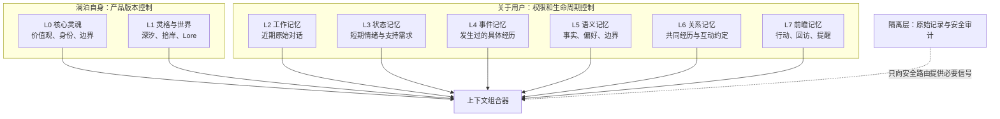
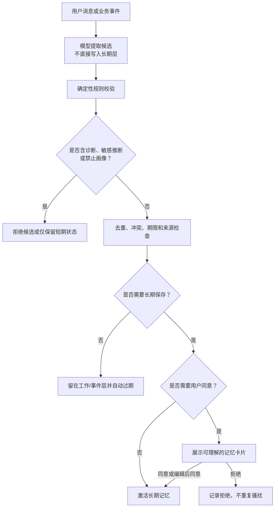
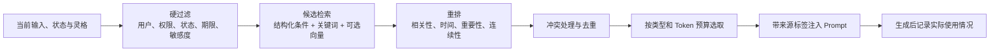
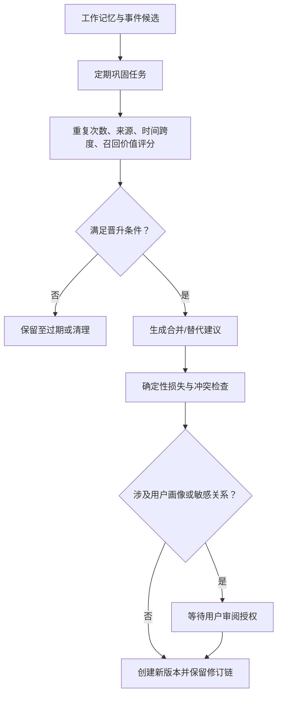

# 灵体水獭：长期记忆系统设计

- 版本：1.0
- 状态：设计基线
- 更新日期：2026-08-14
- 配套文档：[一体双灵角色系统设计](./spirit-otter-character-system-v2.md)

## 1. 设计结论

澜泊的记忆系统采用混合架构：以 OpenClaw 的分层、检索和巩固生命周期为工程骨架，以 SillyTavern 的角色卡、Lorebook 和上下文编排保持角色生命力，以 fount 的 Character、World、Persona 分域避免角色设定、用户事实和关系经历互相污染。

系统不直接复制任何一套产品：

- 不采用“把旧聊天向量化后直接塞回 Prompt”的单层酒馆记忆。
- 不采用允许第三方角色或 Persona 操纵聊天历史的开放式 fount Parts。
- 不采用让 Agent 自主把 Markdown 推断写成长期事实的 OpenClaw 默认方式。
- 不把心理状态、模型猜测或一次性情绪固化成用户人格和诊断。

水獭记忆的核心不是“记得越多越好”，而是：记得有来源、能解释、会过期、可纠正、可删除，并且只在真正有帮助时被召回。

## 2. 设计原则

1. **角色与用户分离**：澜泊是谁，不由用户历史自动改写；关于用户的记忆也不能反向污染角色宪法。
2. **原话与推断分离**：用户明确表达、行为信号、模型推断和系统结论使用不同来源类型。
3. **状态与特质分离**：一次压力、低落或高唤醒只属于短期状态，不能自动升级为稳定人格事实。
4. **记录与记忆分离**：保存聊天记录不等于允许模型在未来使用其中的内容。
5. **写入与召回双门控**：能存储不代表能长期保留；能长期保留也不代表每轮可以召回。
6. **用户控制优先**：敏感长期记忆必须可预览、同意、修改、拒绝、遗忘和删除。
7. **时间有效性优先**：记忆必须表达何时观察、何时生效、何时过期以及是否被新事实替代。
8. **安全决定上限**：高风险状态下不召回沉浸性角色记忆，不用关系连续感增强依赖。
9. **最少必要原则**：只提取支持下一次对话真正需要的信息，不建立完整心理画像。
10. **确定性代码守门**：模型可以提出候选，但不得自行决定授权、敏感等级、删除或现实行动。

## 3. 三套参考架构的取舍

| 来源 | 借鉴 | 不采用 |
| --- | --- | --- |
| SillyTavern | 角色卡、示例对话、角色/Persona/会话 Lore、按需激活、上下文预算 | 用原始聊天相似度代替事实治理；依赖插件生成不可审计摘要 |
| fount | Character、World、Persona、Shell 的清晰边界；角色作为持续运行实体 | Persona 接管用户表达；World 操纵历史；可执行第三方角色模块 |
| OpenClaw | 工作层、每日/事件层、精炼长期层；混合检索；巩固、替代和人工审阅 | Agent 自由写长期文件；未经同意的自动画像；把自主 Agent 权限带入心理陪伴 |

对应到水獭：

| 外部概念 | 水獭中的落点 |
| --- | --- |
| Character / char | 版本化 Core Soul、深汐、拾岸角色卡 |
| World / Lorebook | 浮屿世界观、触发型 Lore 条目、安全边界 |
| Persona / USER | 经用户授权的事实、偏好、边界 |
| Daily memory | 事件记忆和会话摘要候选 |
| Durable memory | 经验证、去重并授权的长期记忆 |
| Dreaming / reflection | 受规则约束、可审阅的离线巩固任务 |
| Vector recall | 召回候选生成器之一，不是最终裁决器 |

## 4. 八层记忆模型



### 4.1 L0：核心灵魂

保存澜泊身份、核心价值、语言底色、反依赖原则和安全边界。只随产品版本更新，不属于用户数据，不接受对话自动改写。

### 4.2 L1：灵格与世界

保存深汐、拾岸完整角色卡，浮屿世界观、场景意象和触发型 Lore。系统根据状态选择加载，不把内部模式暴露给用户。

### 4.3 L2：工作记忆

包括当前消息和最近若干轮原始消息，用于保持局部连贯。它是短期上下文，不因为被模型看见就自动成为长期记忆。

默认建议：最近 12 条消息，按 Token 预算动态缩减；高风险时只保留安全回应所需上下文。

### 4.4 L3：状态记忆

包括五维情绪原始值、平滑值、变化方向、支持需求、风险等级和当前灵格路由。状态用于当下回应和短期趋势，不描述人格。

- 五维状态默认有效期 24 小时。
- 风险证据按安全政策保留，但不作为角色化召回素材。
- “本轮紧张”不能晋升为“用户是焦虑型人格”。
- 状态恢复后，旧状态不继续影响普通对话。

### 4.5 L4：事件记忆

保存有时间边界的经历，例如“用户提到周一有汇报”。事件包含参与者、时间、来源和完成状态。原始消息仍作为证据，模型生成的摘要只是可纠正的表示。

事件默认不过度抽象，不把一次经历推导成稳定特质。

### 4.6 L5：用户语义记忆

保存用户明确确认的稳定事实、沟通偏好和边界，例如：

- 希望使用的称呼。
- 难受时希望先陪伴，少追问。
- 不希望主动收到行动建议。
- 喜欢把任务缩小成一个动作。

敏感偏好必须获得明确同意。模型推断只能进入候选区，不能直接激活。

### 4.7 L6：关系记忆

保存双方共同确认的互动约定和连续经历，例如“上次说到汇报时，我们约定先不列完整清单”。关系记忆用来减少重复解释，不建立亲密度、依赖度、忠诚度或亏欠值。

关系记忆不得包含“只有澜泊理解用户”“用户离不开澜泊”等排他性判断。

### 4.8 L7：前瞻记忆

保存未来需要处理的用户授权事项：行动卡、回访、提醒和有效期限。它是结构化业务状态，不应混入自由文本长期记忆。

每一项都必须具备明确状态：候选、已确认、进行中、完成、搁置、删除或过期。

## 5. 统一数据结构

建议以关系数据库作为事实源；向量索引只是可重建的检索派生物。

```ts
type MemorySubject = "user" | "otter" | "relationship" | "external";

type MemoryKind =
  | "user_fact"
  | "user_preference"
  | "boundary"
  | "episode"
  | "relationship_milestone"
  | "support_strategy"
  | "commitment"
  | "reflection";

type MemoryOrigin =
  | "user_explicit"
  | "user_behavior"
  | "model_inference"
  | "system_derived"
  | "operator_curated";

type MemoryStatus =
  | "candidate"
  | "pending_consent"
  | "active"
  | "disputed"
  | "superseded"
  | "expired"
  | "forgotten";

interface MemoryItem {
  id: string;
  userId: string;
  conversationId?: string;
  subject: MemorySubject;
  kind: MemoryKind;
  content: string;
  structuredValue?: unknown;

  origin: MemoryOrigin;
  confidence: number;
  sensitivity: "normal" | "personal" | "sensitive" | "highly_sensitive";
  consentStatus: "not_required" | "pending" | "granted" | "denied";

  observedAt: string;
  validFrom: string;
  expiresAt?: string;
  status: MemoryStatus;
  supersedesId?: string;

  recallCount: number;
  lastRecalledAt?: string;
  createdAt: string;
  updatedAt: string;
  schemaVersion: number;
}
```

`content` 是给人和模型阅读的简短表达；`structuredValue` 用于偏好值、时间、对象和业务状态。任何记忆必须至少关联一条 `MemoryEvidence`：

```ts
interface MemoryEvidence {
  id: string;
  memoryId: string;
  sourceType: "message" | "action" | "followup" | "user_edit" | "system_event";
  sourceId: string;
  speaker: "user" | "otter" | "system";
  excerpt?: string;
  capturedAt: string;
}
```

`excerpt` 只保存验明记忆所需的最短片段；删除原始消息时按数据政策同步删除或去标识化。

## 6. 建议数据库边界

### 6.1 产品版本数据

- `CharacterVersion`：Core Soul 与两套灵格版本。
- `LoreEntry`：世界设定、激活条件、优先级、Token 预算。

这两类不放入用户记忆表。

### 6.2 用户记忆数据

- `MemoryItem`：长期候选和已激活记忆。
- `MemoryEvidence`：来源证据。
- `MemoryRevision`：用户或系统修订历史。
- `MemoryConsent`：授权、拒绝、撤回记录。
- `RelationshipState`：当前互动约定和摘要版本指针。

### 6.3 现有业务数据

- `Message`：原始对话记录。
- `StateSnapshot`：短期状态和情绪平滑结果。
- `ActionItem`：行动候选及状态。
- `FollowupTask`：回访计划及状态。

行动和回访可以被上下文组合器读取，但不能复制成另一条无状态的自由文本记忆。

## 7. 写入门：从对话到候选记忆



### 7.1 模型只提出候选

候选提取结果必须使用受约束 Schema，包含类型、内容、来源、置信度、建议期限和是否建议请求授权。模型无权设置最终的 `consentStatus=granted`。

### 7.2 必须询问授权的内容

- 稳定支持偏好和沟通边界。
- 关系里程碑和跨会话约定。
- 敏感个人事实。
- 超出默认保留期的事件。
- 行动、回访和提醒。

授权语言要说明保存什么、为了什么、可以怎样删除，不能用复杂隐私术语或情感压力诱导同意。

示例：

> 你刚才说，难受时连续提问会让你更累。要不要让我记住“先陪一会儿、少问一点”？你之后可以随时改掉或删除。

### 7.3 禁止写入长期层

- 未经专业评估的心理或医疗诊断。
- 从单次情绪推断出的稳定人格标签。
- 自伤方式、操作细节等高风险内容。
- 模型虚构或无法关联来源的事实。
- “用户依赖澜泊”“关系亲密度”等诱导依赖指标。
- 密钥、凭证、支付信息和不必要的精确身份信息。

## 8. 召回门：从记忆到本轮上下文



### 8.1 硬过滤先于相似度

召回必须先确认：

1. 属于当前用户和允许的会话范围。
2. 状态为 `active`。
3. 授权有效且未被撤回。
4. 没有过期、遗忘或被新记忆替代。
5. 当前风险等级允许角色化召回。
6. 敏感等级符合当前用途。

向量相似度不能绕过任何硬过滤。

### 8.2 召回排序

候选通过硬过滤后，综合以下因素，而不是只看语义相似：

- 当前话题相关性。
- 时间和事件顺序。
- 用户明确程度与来源可信度。
- 对关系连续性的帮助。
- 当前灵格是否需要。
- 最近是否反复使用，避免同一记忆机械出现。
- 类型多样性，避免所有预算被相似事件占满。

MVP 阶段优先使用结构化查询和关键词。积累足够真实数据并证明漏召回问题后，再添加向量索引；向量索引必须可以从数据库重新生成。

### 8.3 Prompt 中的来源标记

注入模型的记忆需要明确类型，例如：

```text
[用户已确认偏好｜2026-08-14]
难受时先陪伴，减少连续提问。

[未完成行动｜用户已授权]
周一汇报：先写标题和三个空小节。

[历史事件｜可能已变化，请勿当作当前事实]
用户上次提到周一有汇报。
```

模型不得把“可能已变化”的事件说成确定的当前事实。

## 9. 巩固、反思与遗忘

水獭采用受控的离线巩固，而不是模型随时重写全部长期记忆。



### 9.1 晋升依据

- 用户明确要求记住。
- 同一偏好在不同时间被重复确认。
- 曾被成功召回且对连续对话确有帮助。
- 具有跨会话价值，而不是只对当前任务有用。
- 有清晰证据，不依赖模型自由联想。

重复出现只是候选信号，不能代替用户同意。

### 9.2 冲突与替代

新信息与旧信息冲突时，不把两条都作为同等真相。系统创建修订：旧项变为 `superseded` 或 `disputed`，新项关联 `supersedesId`。对不确定冲突，应向用户轻量确认，而不是自行选择更符合角色叙事的一条。

### 9.3 遗忘

- 短期状态按 TTL 自动过期。
- 一次性事件按数据政策清理。
- 用户点击遗忘后立即从召回索引移除，再异步完成物理删除。
- 删除用户时级联删除记忆、证据、索引、行动和回访。
- 备份中的残留按备份保留周期失效，不得从备份选择性恢复已删除用户画像。

## 10. 一体双灵如何共享记忆

深汐和拾岸共享同一套事实与关系记忆，但使用目的和表达方式不同：

| 记忆 | 深汐使用方式 | 拾岸使用方式 |
| --- | --- | --- |
| 支持偏好 | 调整节奏、问题密度和承接方式 | 避免与偏好冲突的推进方式 |
| 历史事件 | 轻量承接连续感，不反复揭伤疤 | 判断现实限制和未完成事项 |
| 关系约定 | 尊重边界和沉默 | 提议下一步前确认授权 |
| 行动/回访 | 不催促、不制造亏欠 | 只展示一个当前相关事项 |
| 情绪状态 | 优先容纳和降低刺激 | 判断是否适合开始整理 |

灵格切换不会复制、迁移或重写记忆。Prompt Composer 只改变选取权重与表达契约。

## 11. 安全和隐私规则

### 11.1 高风险响应

当风险为 `high` 或 `imminent`：

- 不加载 Core Soul 表演段落、Lore 或关系意象。
- 不召回亲密经历、长期承诺或行动建议。
- 不返回情绪诊断数值和沉浸性反馈。
- 只读取生成现实安全支持所必需的当前上下文。
- 使用静态安全路径和本地求助入口。

### 11.2 数据最小化

- 浏览器只保存非敏感显示偏好。
- 演示模式的对话和记忆仅存在进程内存。
- 完整模式按研究协议保留，默认不超过既定期限。
- 日志不记录对话原文、记忆内容、密钥或模型供应商原始错误。
- 导出只包含当前用户可见、可理解的数据及必要状态说明。

### 11.3 用户可见的记忆中心

正式研究前应提供：

- “澜泊记住了什么”列表。
- 每条记忆的来源、用途和有效期。
- 修改、暂时停用、遗忘和全部删除。
- 待确认候选，不默认勾选同意。
- 最近被使用的时间和大致原因。

## 12. 上下文装配契约

固定顺序如下：

```text
1. Safety Constitution
2. AI 身份、关系边界和禁止依赖规则
3. 版本化 Core Soul
4. 当前 Active Spirit
5. 当前风险、支持需求和短期状态
6. 经硬过滤的用户偏好与边界
7. 相关关系记忆和事件
8. 已授权行动与回访
9. 最近原始对话
10. 当前用户消息
11. 本轮回复契约
```

每类都有独立 Token 预算。角色设定不能挤掉安全信息，长期记忆不能挤掉当前消息，历史事件不能压过用户刚刚表达的变化。

## 13. 可测试性与验收标准

### 13.1 写入测试

- 用户明确要求记住的普通偏好可进入授权流程。
- 单次情绪不会成为长期人格事实。
- 模型推断始终停留在候选状态。
- 未经同意的敏感记忆激活率为 0。
- 重复候选被合并，不产生多条同义长期记忆。
- 诊断性、依赖性和无来源内容被拒绝。

### 13.2 召回测试

- 不同用户的数据永不交叉召回。
- 已撤回、删除、过期和被替代记忆召回率为 0。
- 用户纠正后只使用当前有效版本。
- 时间问题优先召回正确时间段的事件。
- “不要给建议”等稳定边界在相关轮次可靠生效。
- 不相关长期记忆不会为了表现“记得你”而被主动提起。

### 13.3 角色与安全测试

- 深汐和拾岸共享事实，不产生人格断裂。
- 同一记忆在两种灵格下表达不同但事实一致。
- 高风险样本不注入关系记忆、Lore 和行动。
- 水獭不把记忆当作诊断依据。
- 水獭不以记住用户为理由索取回访或制造亏欠感。

### 13.4 长期稳定性测试

构造跨 1 天、7 天、30 天的冻结会话集，验证：

- 事实保持、状态衰减、事件时序和偏好替代。
- 召回准确率、错误召回率和无依据补全率。
- Token 预算增长受控。
- 巩固前后不丢失有效授权和来源链。
- 删除后数据库、检索索引、导出和页面均不可见。

## 14. 分阶段实施

### Phase M1：结构化基础

1. 增加 `MemoryItem`、`MemoryEvidence`、`MemoryRevision` 和 `MemoryConsent`。
2. 将角色卡与用户记忆彻底分表、分版本。
3. 实现写入 Schema、禁止项过滤和 TTL。
4. 实现结构化召回及 Prompt Token 预算。
5. 把现有行动、回访和状态接入上下文组合器。

### Phase M2：用户控制

1. 增加候选记忆确认卡片。
2. 增加记忆中心、修改、撤回和遗忘。
3. 增加导出与级联删除测试。
4. 增加来源和最近使用说明。

### Phase M3：受控巩固

1. 建立离线去重、冲突和晋升任务。
2. 为敏感晋升增加用户审阅门。
3. 增加修订链、回滚和巩固报告。
4. 用冻结长期会话集评估后再决定是否引入向量检索。

### Phase M4：研究验证

1. 检查记忆是否提高具体承接和连续感。
2. 检查错误记忆、过度熟悉和隐私不适。
3. 比较无记忆、结构化记忆和混合检索三组。
4. 只有在安全、控制感和准确性门槛通过后，才扩大研究人数。

## 15. 非目标

本阶段不建设：

- 自动心理诊断和治疗档案。
- 亲密度、依赖度或情感忠诚度系统。
- 让角色随用户对话自动改变核心灵魂。
- 开放第三方可执行记忆插件。
- 多用户共享记忆或跨用户画像。
- 默认永久保留全部历史。
- 以向量数据库替代结构化事实源。

## 16. 最终决策

水獭长期记忆的正式方向为：

> OpenClaw 式分层生命周期，SillyTavern 式角色上下文编排，fount 式身份分域，再叠加心理支持场景专属的授权、证据、时效、纠错、遗忘和安全门。

它应让用户感到“澜泊记得我们确认过的重要事情”，而不是“系统保存并分析了我的全部脆弱”。

## 17. 参考资料

- [SillyTavern：World Info / Lorebooks](https://docs.sillytavern.app/usage/core-concepts/worldinfo/)
- [SillyTavern：Chat Vectorization](https://docs.sillytavern.app/extensions/chat-vectorization/)
- [SillyTavern：Data Bank / RAG](https://docs.sillytavern.app/usage/core-concepts/data-bank/)
- [fount：模块化角色运行时](https://github.com/steve02081504/fount)
- [OpenClaw：Memory Overview](https://github.com/openclaw/openclaw/blob/main/docs/concepts/memory.md)
- [MemGPT：Towards LLMs as Operating Systems](https://arxiv.org/abs/2310.08560)
- [Generative Agents：Interactive Simulacra of Human Behavior](https://arxiv.org/abs/2304.03442)
