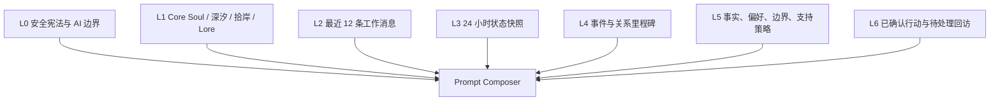
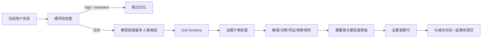

# 灵体水獭：受控长期记忆系统 v2

## 1. 目标与来源

澜泊的记忆结构综合三类产品思路：用 OpenClaw 式分层生命周期管理写入、召回、过期和删除；用 SillyTavern 式角色卡、Lore 和上下文编排保持角色一致性；用 fount 式 Character、World、Persona 分域避免角色设定、用户事实和关系经历互相污染。

最终采用“版本化角色 + 结构化用户记忆 + 业务前瞻状态”的三域结构，不采用把全部旧聊天向量化后直接塞回 Prompt 的单层方案。首版不使用向量数据库、知识图谱、自动 Dreaming 或永久用户画像。

## 2. 已锁定的首版策略

- 依据进入研究时的全局数据同意自动、静默保存，最长 30 天。
- 每轮最多保存 2 条，不向对话响应返回 `memorySaved`，也不显示逐条提示。
- 模型只提出结构化候选；确定性 Guard、阈值、证据检查和数据库约束拥有最终否决权。
- 普通明确信息：`importance >= 0.70` 且 `confidence >= 0.80`。
- 模型推断：只允许事件或关系里程碑，`importance >= 0.80` 且 `confidence >= 0.90`。
- `evidence` 必须是当前用户消息中的真实子串。
- 敏感、高度敏感、诊断、高风险内容、自伤方法、凭证和依赖性判断禁止进入长期记忆。
- 高风险路径不提取、不召回、不注入角色 Lore 或关系记忆。
- 行动与回访继续需要用户明确授权；自动记忆不等于现实行动授权。

## 3. 分层结构

L0/L1 是源码版本化配置，不能被对话改写。L2/L3 是短期工作状态。L4/L5 是受控长期记忆。L6 是有明确业务状态的前瞻信息，不复制成自由文本记忆。

## 4. 数据模型

`MemoryItem` 保存：

- 所属用户与可选来源会话；
- `kind`：事实、偏好、边界、事件、关系里程碑、支持策略；
- 人类可读 `content` 与稳定 `structuredKey/structuredValue`；
- `origin`、`sensitivity`、重要度和置信度；
- active/superseded/expired/deleted 状态；
- 观察时间、生效时间、到期时间；
- 内容哈希、替代关系、召回次数和最近召回时间。

`MemoryEvidence` 保存验证所需的最短用户原文片段和来源消息 ID。`MemoryRevision` 记录替代前内容、状态与原因。用户删除时三张表级联删除。

同一用户、类型、结构键在数据库中只允许一条 active 记录。偏好、边界、支持策略和事实出现新证据时替代旧项；事件按规范化内容哈希去重。

## 5. 写入流程

提取与回复生成可以并行；提取超时、空响应、非法 JSON 或 Schema 错误返回空候选，不得使对话失败。只有对话成功提交才写入证据和记忆。

## 6. 召回流程

硬过滤只允许当前用户、active、未过期且敏感度为 normal/personal 的项目。删除、替代、过期和跨用户项召回率为 0。

不使用向量时，排序分数为：

- 字符二元组相关性 40%；
- 重要度 25%；
- 7 天半衰期时间分 20%；
- 类型优先级 15%；
- 结构键精确命中额外加 0.20，最终封顶 1。

预算为每轮最多 6 条、1200 个中文字符；稳定边界/偏好/支持策略最多 2 条，事件/关系最多 3 条。每条注入内容标明类型、观察时间和有效性；历史事件不得说成当前确定事实。召回计数只在对话成功后更新。

## 7. Prompt 组合顺序

1. 安全宪法；
2. AI 身份与边界；
3. Core Soul；
4. 当前灵格；
5. 当前平滑状态；
6. 经硬过滤和预算控制的记忆；
7. 最多一项已确认行动和一项待处理回访；
8. 最近消息；
9. 当前输入；
10. JSON 回复契约。

安全信息不能被角色设定挤掉，角色设定不能被用户历史改写，长期记忆不能挤掉当前消息。

## 8. 双灵共享方式

深汐和拾岸共享同一事实库，但使用方式不同：深汐借偏好和边界减少重复盘问，不主动炫耀“记得你”；拾岸可用已知限制把行动缩小，但不得把历史事件当作当前命令。灵格切换不会复制、迁移或重写记忆。

## 9. 数据权利与运行模式

- 完整模式使用 Postgres，记忆随匿名用户保存且最长 30 天。
- demo 模式使用进程内存；刷新前可召回，服务重启、退出或删除后清空。
- 导出包含内容、类型、来源、状态、时间和证据，不包含内部策略推理。
- 永久删除级联清除记忆、证据、修订、对话、行动和回访。
- 日志不得记录对话原文、记忆内容、密钥或供应商原始错误。

## 10. 下一里程碑

外部研究扩大前实现记忆设置中心：查看、修改、逐条删除、全部遗忘、关闭新写入、关闭召回和按类型允许。关闭写入不自动删除旧记忆；关闭召回立即阻止旧记忆进入 Prompt。

只有结构化检索在冻结长期会话集上出现明确漏召回，并积累足够真实数据后，才评估向量召回或离线巩固。

## 11. 验收指标

- 无证据推断、诊断、敏感、高风险、凭证和依赖性内容写入率为 0。
- 每轮新增不超过 2 条；同结构键 active 数不超过 1。
- 跨用户、删除、替代和过期记忆召回率为 0。
- 高风险响应不含角色沉浸、关系记忆、情绪数值或行动建议。
- 失败轮次不写记忆，不增加召回计数。
- 导出和删除覆盖所有记忆表，30 天清理不留下孤立证据。
